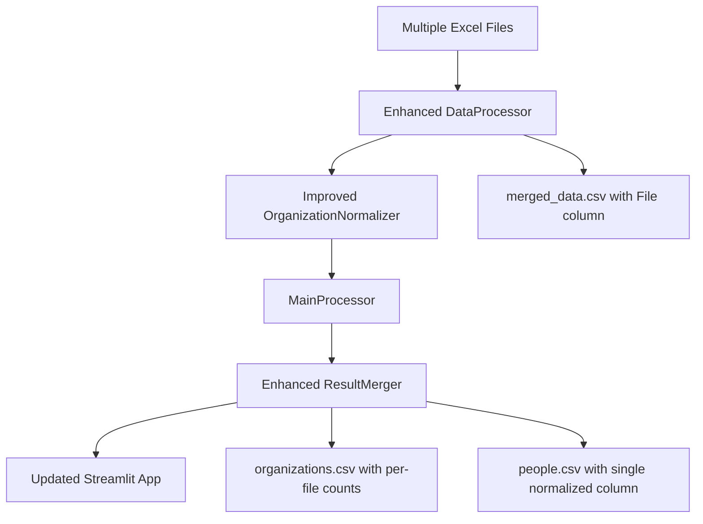

# Design Document

## Overview

This design document outlines the version 2.0 improvements for the data processing system. The improvements focus on enhanced fuzzy matching for organization normalization, multi-file input processing capabilities, and restructured output formats to better support analysis across multiple data sources.

The system currently processes single Excel files through a pipeline that includes data loading, organization normalization, web scraping, and insurance classification. Version 2.0 extends this to handle multiple input files while improving the quality of organization name normalization.

## Architecture

### Current Architecture
The existing system follows this flow:
1. **DataProcessor** - Loads Excel file and merges sheets
2. **OrganizationNormalizer** - Normalizes organization names using fuzzy matching
3. **MainProcessor** - Coordinates web scraping and classification
4. **ResultMerger** - Generates final CSV outputs
5. **Streamlit App** - Provides web interface for data visualization

### Enhanced Architecture for V2.0
The improved architecture maintains the same core components but enhances them:



## Components and Interfaces

### 1. Enhanced DataProcessor

**Purpose**: Process multiple Excel files and create unified dataset with source tracking

**Key Changes**:
- Scan `data/raw/` directory for all `.xlsx` files
- Add `File` column to track source file (filename without extension)
- Generate `merged_data.csv` with combined data from all files

**Interface**:
```python
class DataProcessor:
    def process_multiple_excel_files(self, raw_dir: str = "data/raw") -> pd.DataFrame:
        """Process all Excel files in directory and create unified dataset"""
        
    def add_file_source_column(self, df: pd.DataFrame, filename: str) -> pd.DataFrame:
        """Add File column before Type column"""
```

### 2. Improved OrganizationNormalizer

**Purpose**: Enhanced fuzzy matching with better duplicate detection and quote stripping

**Key Improvements**:
- Strip double quotes from all organization names
- Improved fuzzy matching algorithm with better similarity validation
- Enhanced conflict detection for similar but different organizations
- Better handling of common organization name patterns

**Interface**:
```python
class OrganizationNormalizer:
    def clean_organization_name(self, name: str) -> str:
        """Enhanced cleaning including quote stripping"""
        
    def improved_fuzzy_matching(self, org_list: List[str]) -> Dict[str, str]:
        """Better fuzzy matching with enhanced validation"""
        
    def validate_similarity_enhanced(self, org1: str, org2: str) -> bool:
        """Improved similarity validation with better conflict detection"""
```

### 3. Enhanced ResultMerger

**Purpose**: Generate outputs with multi-file support and improved structure

**Key Changes**:
- Create `organizations.csv` with per-file participant counts
- Generate `people.csv` with single normalized organization column
- Add `File` column to people data

**Interface**:
```python
class ResultMerger:
    def create_multi_file_organizations_csv(self, data: pd.DataFrame) -> pd.DataFrame:
        """Create organizations.csv with participants_{filename} columns"""
        
    def create_simplified_people_csv(self, data: pd.DataFrame) -> pd.DataFrame:
        """Create people.csv with single Home Organization column"""
```

### 4. Updated Streamlit App

**Purpose**: Handle new data structure and column names

**Key Changes**:
- Update references from `Home organization_normalized` to `Home organization`
- Display file source information
- Handle multi-file participant count columns

## Data Models

### Input Data Structure
```
data/raw/
├── COP29.xlsx
├── COP28.xlsx
└── COP27.xlsx
```

### Enhanced merged_data.csv
```csv
File,Type,Nominated by,Home organization,Name
COP29,Party,Brazil,Ministry of Environment,João Silva
COP28,Observer,UAE,Shell International,Sarah Johnson
```

### Enhanced organizations.csv
```csv
organization_name,participants_COP29,participants_COP28,participants_total,is_insurance,website_url,search_method,content_source,processing_status,error_message,processed_at
Shell International,15,12,27,False,https://shell.com,bing,website,completed,,2025-07-29T10:00:00
```

### Simplified people.csv
```csv
File,Type,Nominated by,Home organization,Name,is_insurance
COP29,Party,Brazil,Ministry of Environment,João Silva,False
COP28,Observer,UAE,Shell International,Sarah Johnson,False
```

## Error Handling

### Multi-File Processing Errors
- **Missing Files**: Log warning and continue with available files
- **Corrupted Files**: Skip corrupted file and log error
- **Schema Mismatches**: Attempt to align columns, log discrepancies

### Enhanced Normalization Errors
- **Quote Stripping Failures**: Log warning and continue without stripping
- **Fuzzy Matching Timeouts**: Use fallback matching with lower threshold
- **Memory Issues**: Process organizations in batches

### Output Generation Errors
- **Column Mismatch**: Create missing columns with default values
- **File Write Errors**: Retry with backup location
- **Data Validation Failures**: Log issues but continue processing

## Testing Strategy

### Unit Tests
1. **DataProcessor Tests**
   - Test multi-file loading with various file combinations
   - Verify File column addition and positioning
   - Test handling of missing or corrupted files

2. **OrganizationNormalizer Tests**
   - Test quote stripping functionality
   - Verify improved fuzzy matching with known similar organizations
   - Test conflict detection for different organizations with similar names

3. **ResultMerger Tests**
   - Test multi-file participant count generation
   - Verify single organization column in people.csv
   - Test File column addition to people data

4. **Streamlit App Tests**
   - Test handling of new column structure
   - Verify display of multi-file information
   - Test filtering and search with new data structure

### Integration Tests
1. **End-to-End Multi-File Processing**
   - Process multiple test Excel files
   - Verify complete pipeline execution
   - Validate output file structure and content

2. **Data Consistency Tests**
   - Verify participant counts match across files
   - Test organization name consistency
   - Validate file source tracking

### Performance Tests
1. **Large Dataset Processing**
   - Test with multiple large Excel files
   - Monitor memory usage during processing
   - Verify processing time remains reasonable

2. **Fuzzy Matching Performance**
   - Test improved algorithm with large organization lists
   - Monitor processing time for normalization
   - Verify memory efficiency

### Validation Tests
1. **Data Quality Validation**
   - Verify improved organization normalization reduces duplicates
   - Test quote stripping effectiveness
   - Validate multi-file participant count accuracy

2. **Output Format Validation**
   - Verify CSV structure matches specifications
   - Test Streamlit app compatibility with new formats
   - Validate data integrity across processing steps